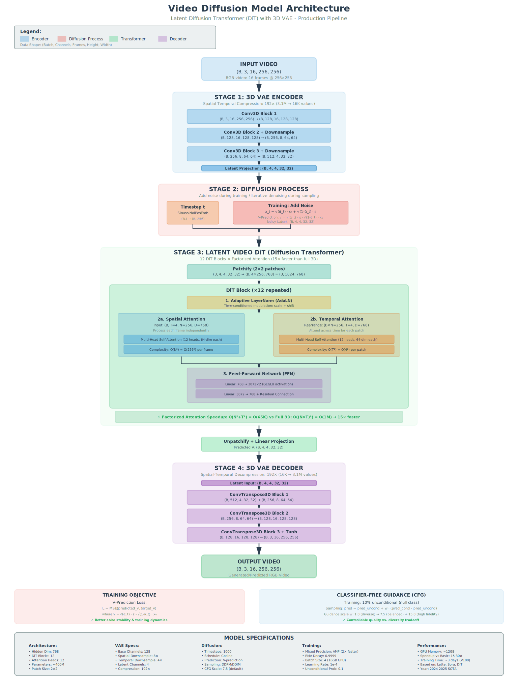

# Video Diffusion Prediction Framework

A PyTorch implementation of a diffusion model for video prediction. This framework uses a 3D U-Net architecture with temporal attention to predict future video frames given context frames.

**Developed by AI Research Group, Department of Civil Engineering, King Mongkut's University of Technology Thonburi (KMUTT)**

## Features

- **Dual Architecture Support**:
  - **Basic**: 3D U-Net for pixel-space diffusion
  - **Advanced**: Latent Diffusion Transformer (DiT) with 3D VAE for high-resolution video
- **Flexible Input**: Supports video files (`.mp4`, `.avi`) and image sequences (folders of frames)
- **Configuration**: YAML-based configuration for both training and inference
- **Multi-GPU Training**: Distributed Data Parallel (DDP) support
- **Video Prediction**: Generate future frames from context frames
- **Unconditional Generation**: Generate videos from pure noise

## Installation

```bash
pip install -r requirements.txt
```

## Directory Structure

```
video_diffusion_prediction/
├── models/
│   ├── diffusion.py          # Basic U-Net model
│   └── advanced_diffusion.py # Advanced DiT + VAE model
├── data/
│   └── video_dataset.py      # Video dataset and dataloaders
├── train.py                  # Basic training script
├── train_advanced.py         # Advanced training script (DiT)
├── predict.py                # Basic inference script
├── predict_advanced.py       # Advanced inference script
├── config.yaml               # Basic training config
├── config_advanced.yaml      # Advanced training config
├── predict.yaml              # Basic inference config
├── predict_advanced.yaml     # Advanced inference config
├── requirements.txt          # Python dependencies
└── README.md                 # This file
```

## 🚀 Advanced Model Usage (Recommended)

The advanced model uses a **Latent Diffusion Transformer (DiT)** architecture, similar to Sora or Stable Video Diffusion. It offers higher quality and efficiency.

### 1. Training
Edit `config_advanced.yaml` to set your parameters, then run:

```bash
python train_advanced.py --config config_advanced.yaml
```

**Data Structure:**
You can use video files OR folders of images.
```text
data/train_videos/
├── clip_001.mp4
└── clip_002_folder/
    ├── frame_001.jpg
    ├── frame_002.jpg
    └── ...
```

### 2. Prediction
Edit `predict_advanced.yaml` to point to your checkpoint and input video/folder.

```bash
python predict_advanced.py --config predict_advanced.yaml
```

---

## 🎓 Basic Model Usage (U-Net)

The basic model uses a **3D U-Net**. Good for learning and simple datasets.

### 1. Training
Edit `config.yaml` and `dataset.yaml` (if needed).

```bash
python train.py --config config.yaml --data dataset.yaml
```

### 2. Prediction
Edit `predict.yaml` to set your checkpoint and input.

```bash
python predict.py --config predict.yaml
```

## Training Parameters

### Data Parameters
- `--config`: Path to training configuration YAML (optional)
- `--data`: Path to dataset YAML describing train/val/test splits
- `--train_dir`, `--val_dir`: Override dataset directories directly
- `--output_dir`: Override experiment output directory

### Model / Sequence Parameters
- `--num_frames`: Total frames per training clip (optional with context/future split)
- `--context_frames`, `--future_frames`: Define input vs. prediction window
- `--frame_size`: Frame size (`H W`) or single square value
- `--frame_interval`: Sampling interval between frames
- `--base_channels`, `--channel_mults`, `--time_emb_dim`: Network width/depth controls

### Diffusion Parameters
- `--num_timesteps`: Number of diffusion steps
- `--beta_start`, `--beta_end`: Beta schedule bounds
- `--schedule`: Noise schedule (`linear` or `cosine`)

### Training Parameters
- `--batch_size`, `--epochs`, `--lr`, `--weight_decay`
- `--num_workers`: Data loader worker count
- `--save_interval`: Checkpoint frequency
- `--resume`: Resume from checkpoint path
- `--train_augment` / `--no-train-augment`: Toggle training augmentations
- `--val_augment` / `--no-val-augment`: Toggle validation augmentations
- `--gpus`: Number of GPUs (DDP spawns when >1)

## Inference Parameters

### Common Parameters
- `--checkpoint`: Path to model checkpoint (required)
- `--config`: Training configuration file (optional, defaults to `config.json` beside checkpoint)
- `--data`: Dataset YAML describing context/future frames (optional)
- `--device`: Device to run on - 'cuda' or 'cpu' (defaults to configuration or cuda)
- `--mode`: Inference mode - 'predict' or 'generate'
- `--frame_size`: Frame size as `H W` (inherits from configuration when omitted)
- `--frame_interval`: Frame sampling stride for reading videos (defaults to configuration or 1)
- `--output_dir`: Output directory (defaults to configuration or `./outputs`)
- Architecture overrides: `--base_channels`, `--channel_mults`, `--time_emb_dim`
- Diffusion overrides: `--num_timesteps`, `--beta_start`, `--beta_end`, `--schedule`

### Prediction Mode
- `--input_video`: Input video path (required)
- `--num_context_frames`: Override context frames (inherits from configuration otherwise)
- `--num_future_frames`: Override prediction horizon (inherits from configuration otherwise)
- `--output_name`: Output video name (default: prediction)

### Generation Mode
- `--num_frames`: Total frames to generate (defaults to configuration or 16)
- `--batch_size`: Number of videos to generate (default: configuration or 1)

## Architecture Overview

This repository implements a state-of-the-art **Latent Diffusion Transformer (DiT)** with 3D VAE for high-quality video generation and prediction. The architecture features:

- **3D VAE Encoder/Decoder**: 192× compression (3.1M → 16K values)
- **Diffusion Transformer**: 12 DiT blocks with factorized spatial-temporal attention
- **V-Prediction**: Superior training dynamics and color stability
- **Classifier-Free Guidance**: Controllable quality vs. diversity
- **Mixed Precision Training**: 2× faster with automatic mixed precision
- **~400M parameters** (configurable 100M-3B)

<p align="center">
  
</p>

### Model Architecture Details

#### Advanced Model (Latent DiT) - **Recommended for Production**

**Complete Pipeline:**
1. **3D VAE Encoder**: Compresses video from (B, 3, 16, 256, 256) → (B, 4, 4, 32, 32)
2. **Diffusion Process**: Adds noise (training) or denoises iteratively (inference)
3. **Latent Video DiT**: 12 transformer blocks with factorized attention (15× faster than full 3D)
4. **3D VAE Decoder**: Decompresses latent back to (B, 3, 16, 256, 256)

**Key Features:**
- **Factorized Attention**: O(N²+T²) instead of O((N×T)²) → 15× speedup
- **V-Prediction Parameterization**: Better color coherence than noise prediction
- **Classifier-Free Guidance**: Training with 10% unconditional samples for controllable generation
- **EMA Weights**: Exponential moving average (0.9999) for stable inference

**Performance:**
- Training Speed: 15-30× faster than basic U-Net model
- GPU Memory: ~12GB (batch size 4, mixed precision)
- Training Time: ~3 days on V100 for 100 epochs

#### Basic Model (3D U-Net) - **Educational/Research**

**Architecture:**
- **VideoDiffusionUNet**: Spatial-temporal 3D convolutions with attention
  - Input: Noisy video tensor (B, C, T, H, W) and timestep (B,)
  - Output: Predicted noise tensor (B, C, T, H, W)
  - Components: Sinusoidal time embeddings, residual blocks, multi-head attention, U-Net skip connections

**GaussianDiffusion:**
- Forward Process: Gradually adds noise to videos
- Reverse Process: Denoises videos step by step
- Training: Predicts noise added at random timesteps
- Sampling: Generates videos by iterative denoising

**Use Cases:**
- Learning diffusion model fundamentals
- Research on pixel-space video diffusion
- Smaller datasets or quick prototyping

## Monitoring Training

View training progress with TensorBoard:

```bash
tensorboard --logdir ./runs/experiment1/logs
```

This will display:
- Training and validation loss curves
- Learning rate schedule
- Sample predictions (if implemented)

## Tips for Better Results

1. **Data Quality**: Use high-quality, diverse video data
2. **Frame Rate**: Adjust `frame_interval` based on video motion speed
3. **Model Size**: Increase `base_channels` or `channel_mults` for larger models
4. **Training Time**: Use cosine schedule and lower learning rate for longer training
5. **GPU Memory**: Reduce `batch_size` or `num_frames` if running out of memory
6. **Multi-GPU**: Use DDP for faster training on multiple GPUs

## Hardware Requirements

**Minimum:**
- GPU: 8GB VRAM (NVIDIA GTX 1080 or better)
- RAM: 16GB
- Storage: Sufficient for video dataset

**Recommended:**
- GPU: 24GB VRAM (NVIDIA RTX 3090/4090 or A100)
- RAM: 32GB+
- Storage: SSD for faster data loading

## Memory Optimization

For limited GPU memory, try:

```bash
# Smaller model
python train.py --batch_size 2 --num_frames 8 --base_channels 32 --channel_mults 1 2 4

# Lower resolution
python train.py --batch_size 4 --frame_size 128 128

# Fewer timesteps (faster but lower quality)
python train.py --num_timesteps 500
```

## Citation

If you use this code in your research, please cite:

```bibtex
@misc{video_diffusion_prediction_2025,
  title={Video Diffusion Prediction Framework},
  author={AI Research Group, Department of Civil Engineering, KMUTT},
  year={2025},
  institution={King Mongkut's University of Technology Thonburi},
  howpublished={\url{https://github.com/Sompote/VDO_diffusion}}
}
```

## License

MIT License

## Acknowledgments

This implementation is based on:
- Denoising Diffusion Probabilistic Models (DDPM)
- Video Diffusion Models
- U-Net architecture for diffusion models
