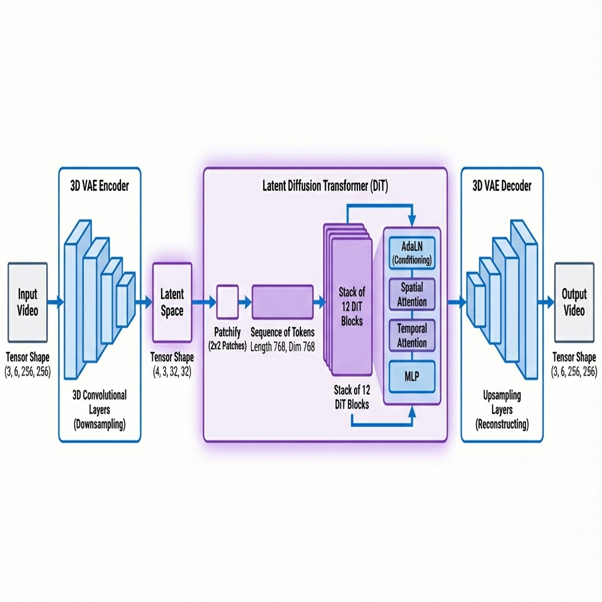

# Advanced Video Diffusion Training (`train_advanced.py`)

This script implements a state-of-the-art **Latent Diffusion Transformer (DiT)** architecture, similar to models like Sora or Stable Video Diffusion. It is designed for high-performance training on larger datasets.

## ⚡ Key Differences

| Feature | Basic (`train.py`) | Advanced (`train_advanced.py`) |
| :--- | :--- | :--- |
| **Architecture** | **3D U-Net** (Standard CNN) | **DiT** (Diffusion Transformer) |
| **Input Data** | Raw Pixels | **Latents** (Compressed via 3D VAE) |
| **Configuration** | `config.yaml` & `dataset.yaml` | **YAML Config** or CLI Flags |
| **Memory** | High (Stores full video) | **Efficient** (Stores compressed latents) |
| **Speed** | Slower | **Faster** (due to compression) |
| **Quality** | Good for simple motion | **State-of-the-Art** (High fidelity) |

## 🏗️ Model Architecture



## 📁 Data Folder Structure

`train_advanced.py` expects a simple folder structure. You do **not** need a `dataset.yaml`.

### Option 1: Video Files (Easiest)
Put all your video clips (`.mp4`, `.avi`, etc.) directly inside the train/val folders.
```text
data/
├── train_videos/
│   ├── clip_001.mp4
│   ├── clip_002.mp4
│   └── ...
└── val_videos/
    ├── clip_100.mp4
    └── ...
```

### Option 2: Image Sequences (Best for raw frames)
Put each video clip in its own sub-folder containing the frames (`.jpg`, `.png`).
```text
data/
├── train_videos/
│   ├── drive_001/
│   │   ├── frame_0001.jpg
│   │   ├── frame_0002.jpg
│   │   └── ...
│   └── drive_002/
│       ├── frame_0001.jpg
│       └── ...
└── val_videos/
    └── ...
```

## 🚀 How to Run

You can run the script using a YAML configuration file (Recommended) or by passing arguments directly.

### 1. Using Config File (Recommended)
Edit `config_advanced.yaml` to set your parameters, then run:

```bash
python train_advanced.py --config config_advanced.yaml
```

### 2. Overriding via CLI
You can override specific settings from the config file by passing them as arguments:

```bash
python train_advanced.py --config config_advanced.yaml --batch_size 2 --lr 5e-5
```

### 3. CLI Only (No Config)
You can still run without a config file if you prefer:

```bash
python train_advanced.py \
    --train_dir ./data/train_videos \
    --output_dir ./runs/advanced_experiment \
    --num_frames 16 \
    --frame_size 256 256 \
    --batch_size 4 \
    --lr 1e-4 \
    --use_amp \
    --use_ema
```

### 4. Full Pipeline (Automated)
To run the complete two-stage training process (Pre-train VAE -> Train DiT), use the provided shell script:

```bash
./train_full_pipeline.sh
```
This script handles:
1.  **Stage 1:** Pre-trains the 3D VAE (100 epochs) to learn efficient video compression.
2.  **Stage 2:** Trains the DiT model (600 epochs) using the pre-trained VAE.

## 🔧 Key Parameters

### Data Settings
*   `--train_dir`: Path to training videos folder.
*   `--val_dir`: Path to validation videos folder (optional).
*   `--num_frames`: Total frames per clip (default: 16).
*   `--frame_size`: Resolution as `Height Width` (default: 256 256).

### Model Architecture (DiT)
*   `--patch_size`: Size of patches to tokenize (default: 2 2).
*   `--hidden_dim`: Width of the transformer (default: 768).
*   `--depth`: Number of transformer blocks (default: 12).
*   `--num_heads`: Attention heads (default: 12).

### VAE (Compression)
*   `--latent_channels`: Channels in compressed latent space (default: 4).
*   `--spatial_downsample`: How much to shrink image size (default: 8x).
*   `--temporal_downsample`: How much to shrink frame count (default: 4x).

### Training Optimizations
*   `--use_amp`: **Highly Recommended.** Uses Automatic Mixed Precision (FP16) to save memory and speed up training.
*   `--use_ema`: Maintains a "shadow" model with smoothed weights for better generation quality.
*   `--gradient_accumulation_steps`: Simulates larger batch sizes (e.g., set to 4 to simulate batch size 16 if you only have memory for 4).

## 🔮 How to Run Inference (Prediction)

After training, you can generate new videos using `predict_advanced.py`.

### 1. Configure Prediction
Edit `predict_advanced.yaml` to match your training settings (especially `video` and `vae` sections) and point to your checkpoint.

```yaml
inference:
  checkpoint: "./runs/advanced_experiment/final_model.pth"
  input_video: "./data/val_videos/clip_100.mp4"
  output_dir: "./outputs/advanced_predictions"

video:
  num_frames: 6               # Must match training
  num_context_frames: 5       # How many frames to condition on
  ...
```

### 2. Run Prediction
```bash
python predict_advanced.py --config predict_advanced.yaml
```

### 3. Run on Cloud (CLI Override)
If you are running on a cloud instance and need to specify paths dynamically:

```bash
python predict_advanced.py \
    --config predict_advanced.yaml \
    --checkpoint runs/advanced_experiment/final_model.pth \
    --input_video data/val_videos/test_clip.mp4
```
